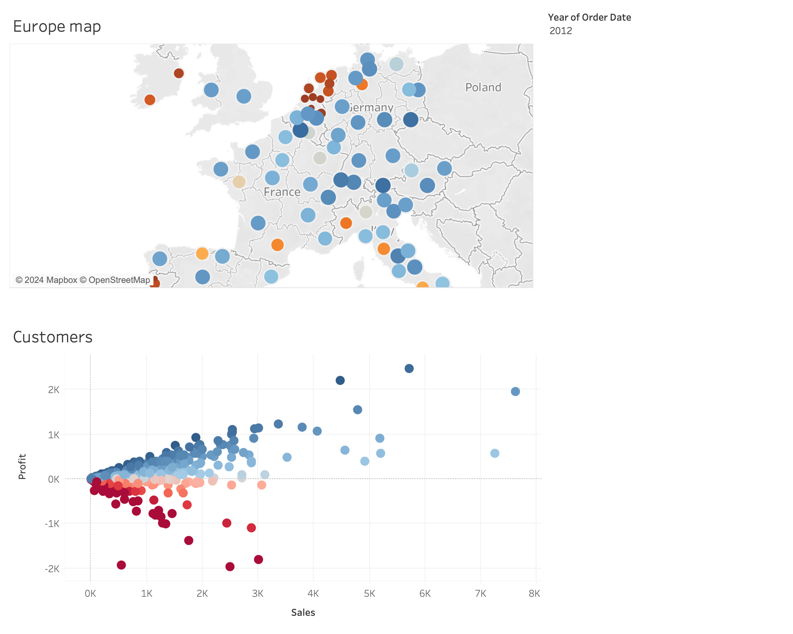
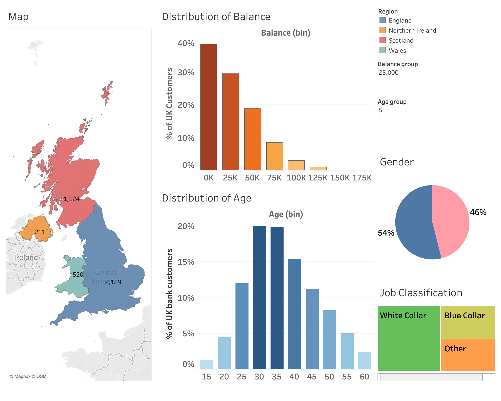

# Tableau Visualization Showcase

## 1. Sales Performance Analysis using P1-AmazingMartEU2 Dataset

Using the **P1-AmazingMartEU2** dataset, I developed a Tableau dashboard to analyze sales performance across multiple regions in Europe.

<!-- Add links or images of Tableau visualizations here -->

### Dashboard Features

- **Map of Total Sales and Profit Margins**: A map showcasing total sales and profit margins by region in Europe.
- **Scatter Plot of Sales vs. Profit**: A scatter plot comparing sales versus profit for different customers over various years.

### Visual Insights

- **Regional Performance**: The map visualization helps identify which regions in Europe have the highest sales and profit margins, providing a quick overview of geographic performance.
- **Customer Profitability**: The scatter plot enables a detailed analysis of customer sales and profitability, revealing patterns and trends across different years.

## 2. UK Bank Customer Dashboard Overview

This dashboard provides an overview of the distribution of bank customers in the UK based on several demographic and financial attributes.

## Map
The map shows the geographical distribution of customers across the UK regions. The numbers on each region indicate the count of customers:
- Scotland: 1,124
- England: 2,159
- Northern Ireland: 211
- Wales: 520

## Distribution of Balance
This bar chart shows the percentage of UK customers across different balance ranges. Most customers have a balance in the lower ranges, with around 40% having a balance of 0K and decreasing percentages for higher balance bins.

## Distribution of Age
This chart displays the age distribution of UK bank customers. The highest percentage of customers falls within the 30-35 age range, indicating a younger customer base.

## Gender
The pie chart shows the gender distribution of customers, with 54% being male and 46% female.

## Job Classification
This stacked bar chart shows the proportion of customers in white-collar and blue-collar job categories, indicating a balanced distribution between the two groups.

Overall, the dashboard gives a comprehensive snapshot of the customer demographics and financial distribution for a UK bank.
